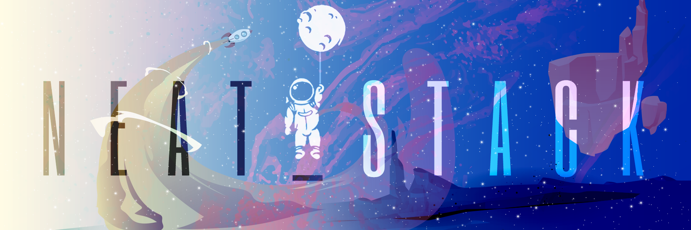

### Welcome to the World🌌☄️  of:
# [Ntropy](https://neat-stack.github.io) 🚀🚀

[</img>](https://rb.gy/efya7z)

>    Designed  🖌️ **MM/86**

📊 **This week I spent my time on**


<!--START_SECTION:waka-->
```text
React       1 hr 47 mins        █████████░░░░░░░░░░░░░░░░   30 %  
C++         24 mins             ██░░░░░░░░░░░░░░░░░░░░░░░   09 % 
Markdown    5 mins              █░░░░░░░░░░░░░░░░░░░░░░░░   03 %
Other       -----               ██████████████████░░░░░░░   68 %
```
<!--END_SECTION:waka-->


## My Toys🪀

 - ### WebDev👨‍💻 

                 
- ### Python & Machine Learning Libraries💻 

        

- ### Graphic Designing
    

<br>


<br>

| **Projects**       | **Hits**           |**Stars**  |
| :-------------: |:-------------:| :-----:|
| [Neat-Stack Portolio](https://neat-stack.github.io)      | [](http://hits.dwyl.com/Neat-Stack/Neat-Stack)  |  |
| Camper      |      |    |
| 3RD PROJECT |       |     |


<!--
**Neat-Stack/Neat-Stack** is a ✨ _special_ ✨ repository because its `README.md` (this file) appears on your GitHub profile.

Here are some ideas to get you started:

- 🔭 I’m currently working on ...
- 🌱 I’m currently learning ...
- 👯 I’m looking to collaborate on ...
- 🤔 I’m looking for help with ...
- 💬 Ask me about ...
- 📫 How to reach me: ...
- 😄 Pronouns: ...
- ⚡ Fun fact: ...
-->
